# Voxel Car / SynthOccPred

[](https://huggingface.co/spaces/mmkuznecov/VoxelCar)

`voxel_car` is a procedural voxel-world driving project for monocular occupancy prediction and closed-loop planning.

The project builds synthetic 3D voxel road worlds, renders forward-camera driving videos, trains a neural network to predict ego-frame occupancy from a single RGB image, and evaluates closed-loop driving with either:

1. an A* planner over predicted occupancy, or
2. a PPO reinforcement-learning policy that replaces A*.

The current package is organized as a Python `src/` layout package under `src/voxel_car`.

---

## Quick start — run the full pipeline

The entire pipeline (generate → preprocess → train OccNet → A\* eval → train PPO → PPO eval) can be run with a single script from the repo root:

```bash
./full_pipeline.sh
```

Key environment-variable knobs (all have sensible defaults):

| Variable | Default | Description |
|---|---|---|
| `N_SAMPLES` | `15000` | Number of generated worlds |
| `OCC_EPOCHS` | `10` | OccNet training epochs |
| `OCC_BATCH_SIZE` | `128` | OccNet batch size |
| `RL_STEPS` | `1000000` | PPO total environment steps |
| `RL_N_ENVS` | `8` | Parallel training environments |
| `RL_PRESET` | `easy` | Scenario preset for RL training |
| `EVAL_OCC_N` | `20` | Closed-loop A\* evaluation episodes |
| `EVAL_RL_CL_N` | `20` | Closed-loop PPO evaluation episodes |

Skip any stage with:

```bash
SKIP_GENERATE=1 SKIP_PREPROCESS=1 ./full_pipeline.sh
```

---

## What this project does

Overall pipeline:

```text
procedural world + trajectory
        ↓
ray-marched forward camera frames
        ↓
preprocessed image / ego-occupancy memmaps
        ↓
OccNet monocular occupancy model
        ↓
closed-loop driving:
    camera image → OccNet prediction → planner / RL policy → simulator step
```

The simulator itself has access to ground-truth voxels for rendering and scoring, but the closed-loop controller only uses the camera image and the model's predicted ego occupancy.

---

## Demo examples

Here are example outputs from the dataset generator and closed-loop evaluation.

### Run 0000

Static BEV snapshot:

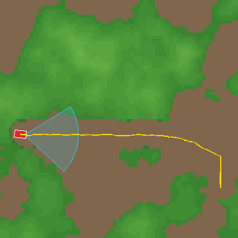

BEV rollout preview:

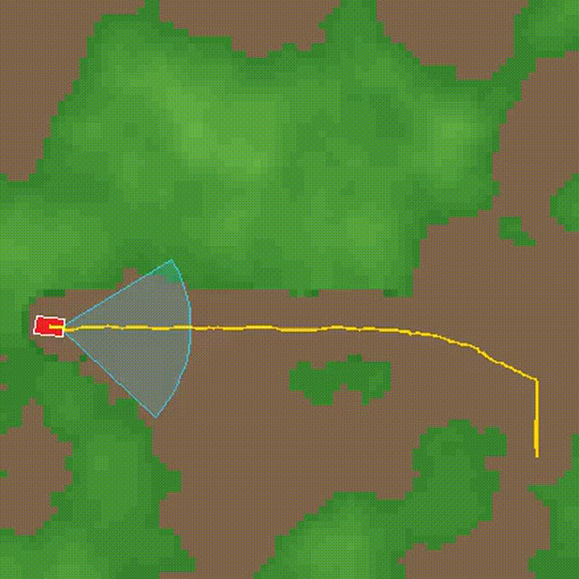

Forward camera preview:


### Run 0001

Static BEV snapshot:

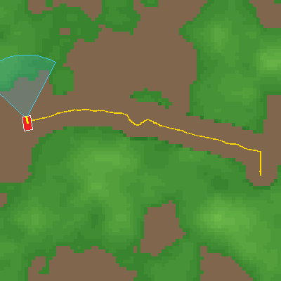

BEV rollout preview:

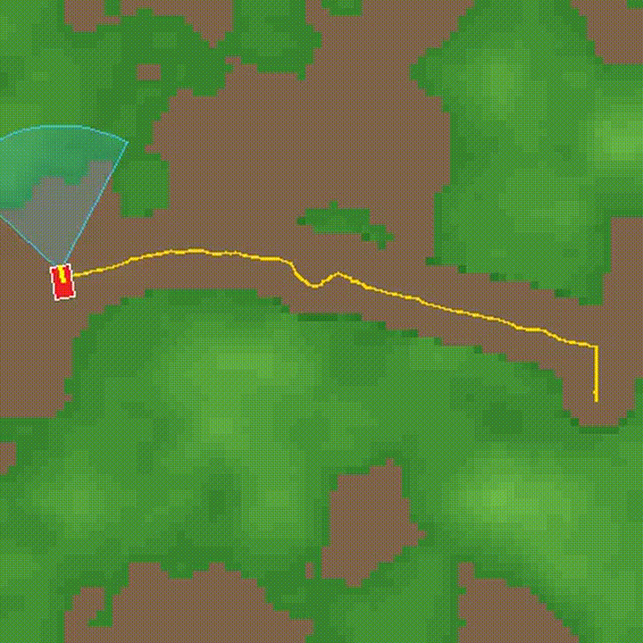

Forward camera preview:

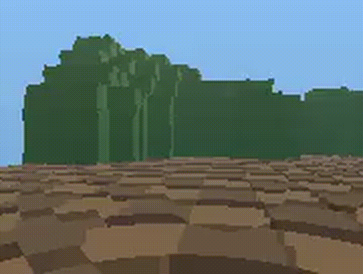

### Run 0002

Static BEV snapshot:

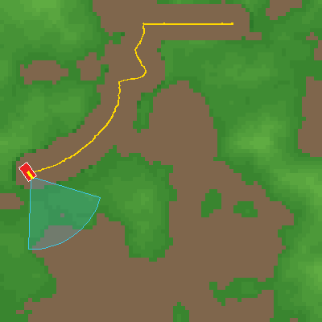

BEV rollout preview:

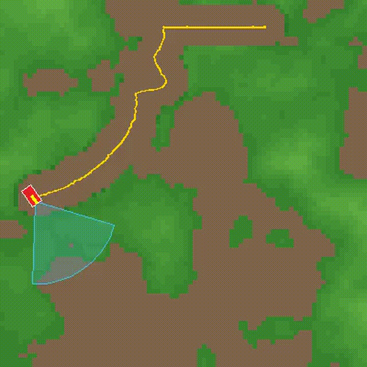

Forward camera preview:

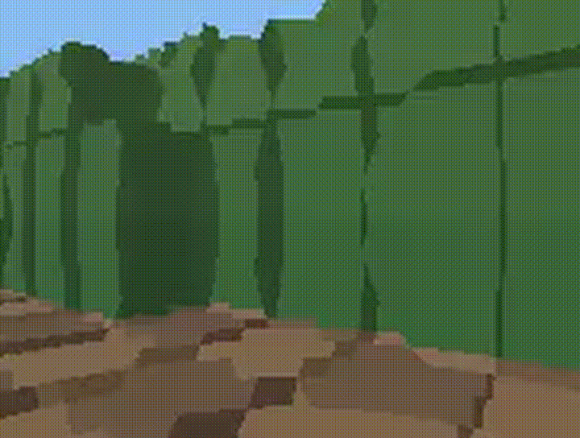

### Run 0003

Static BEV snapshot:

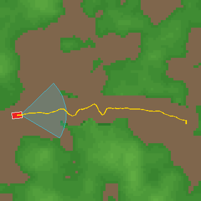

BEV rollout preview:

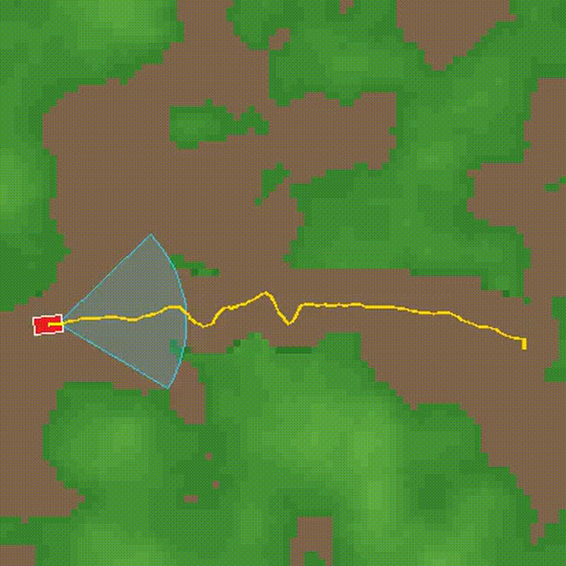

Forward camera preview:


---

## Closed-loop evaluation examples

### A\* planner over OccNet predictions — winding scenario, seed 795

This rollout uses the trained OccNet to predict ego-frame occupancy from the forward camera at each step. A\* plans the next motion over the predicted BEV cost map. Ground-truth voxels are only used for rendering and collision scoring — the planner never sees them.

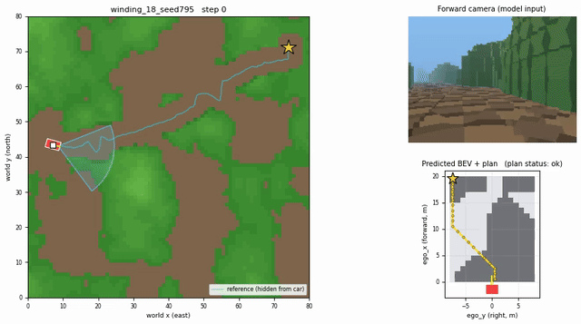

### PPO-RL policy over OccNet predictions — easy scenario, seed 795

This rollout uses the same OccNet backbone but replaces A\* with a pretrained PPO policy. The policy was trained in the fast oracle-BEV environment and is here deployed on OccNet-predicted occupancy.

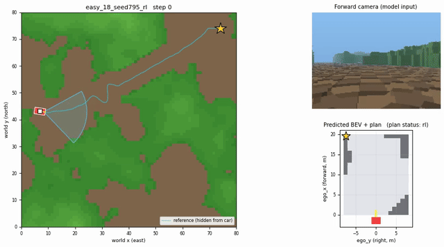

---

## RL training plots

Training curves from the PPO run (`output/RLModel/ppo_main`).

### Reward curve

Episode reward (raw and rolling mean) over the course of training.

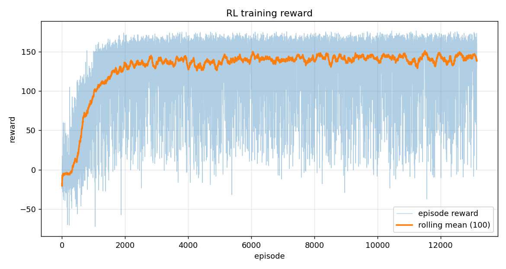

### Episode length

How many steps episodes take on average as the policy improves.

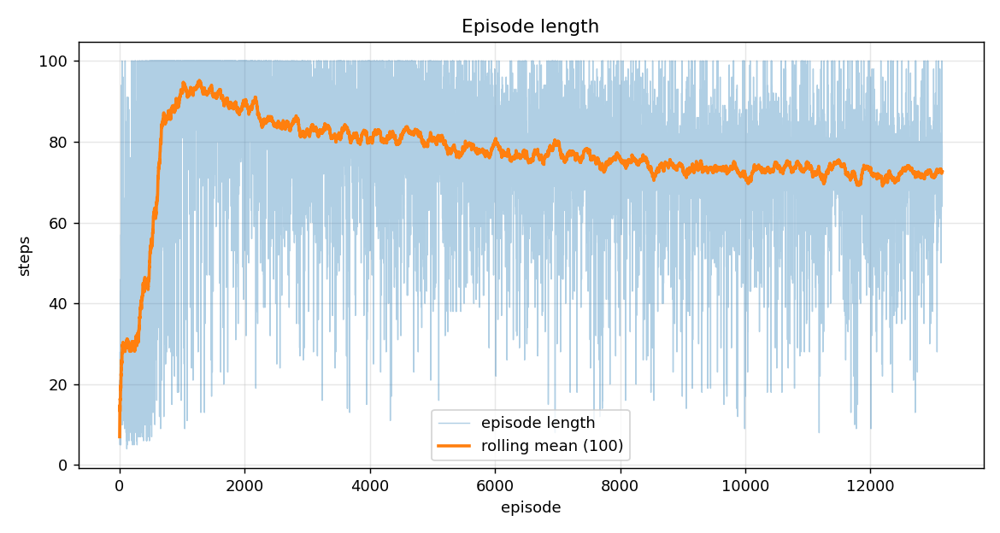

### Rolling outcome rates

Rolling success, collision, OOB, timeout and stuck rates over episodes.

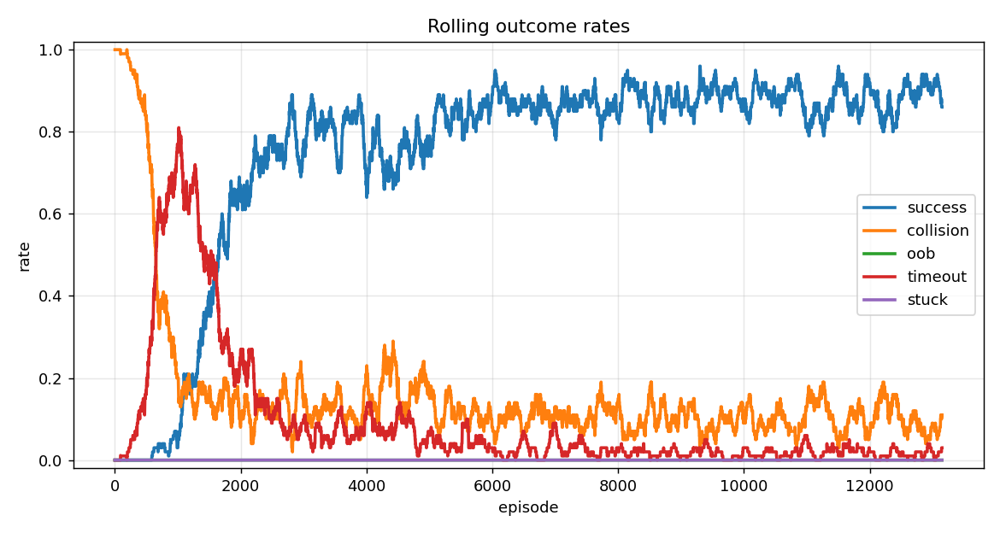

### Final outcome counts

Total episode counts by outcome over the full training run.

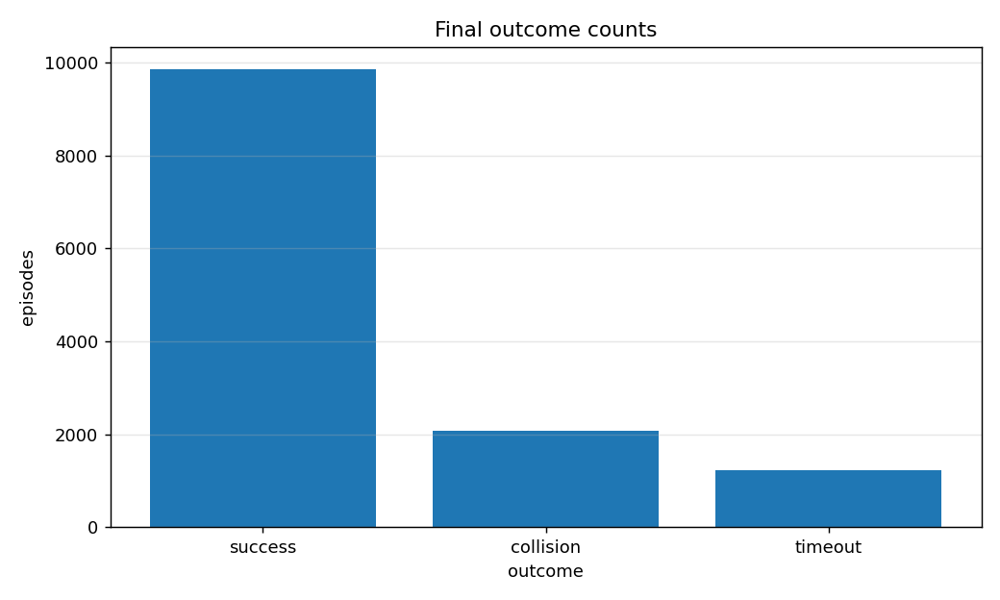

### Distance to goal

Final distance to the goal at episode end (lower = closer to success).

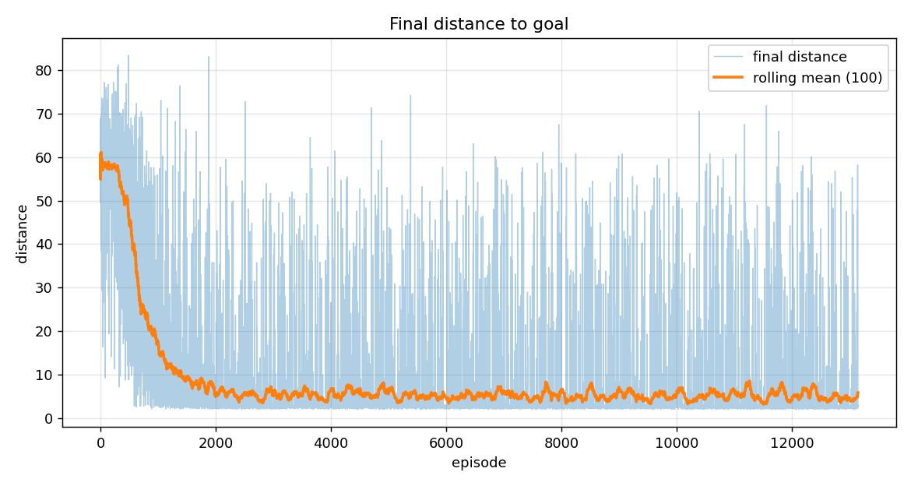

### Success rate by environment step

Rolling success rate plotted against SB3 timestep — useful when comparing runs with different numbers of parallel environments.

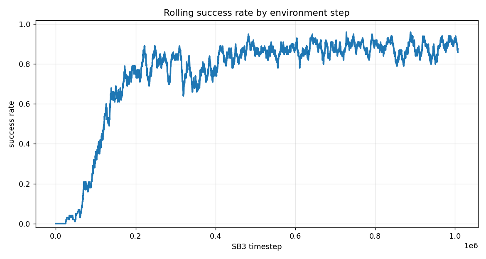

---

## Main capabilities

### Dataset generation

Generate procedural voxel worlds with:

- random composite road trajectories;
- trajectory-aware road and shoulder carving;
- configurable obstacle height, road width, grid size, and terrain noise;
- one or more ray-marched camera videos;
- BEV videos and static BEV snapshots;
- complete metadata per run.

Entry point:

```bash
python generate.py
```

### Preprocessing

Convert generated dataset runs into flat `.npy` memmaps for efficient random-access training.

Entry point:

```bash
python preprocess.py
```

### Occupancy prediction

Train `OccNet`, a CNN-based monocular occupancy predictor.

Entry point:

```bash
python train.py
```

### Closed-loop evaluation with A\*

Run the car through generated scenarios using only the model's predictions from the forward camera. The planner is A\* over the predicted BEV occupancy map.

Entry point:

```bash
python run_closed_loop.py
```

### PPO RL controller

Train and evaluate a PPO policy in a fast oracle-BEV environment, then deploy it in the full visual closed-loop stack.

Entry points:

```bash
python train_rl.py
python eval_rl.py
python run_closed_loop_rl.py
```

### Gradio demo

Launch an interactive UI for:

- random world preview;
- camera configuration;
- video generation;
- dataset sample export;
- closed-loop model demo using Hugging Face Hub models.

Entry point:

```bash
python app.py
```

---

## Repository layout

```text
.
├── app.py                         # Gradio UI launcher
├── full_pipeline.sh               # End-to-end pipeline script
├── generate.py                    # Procedural dataset generator CLI
├── preprocess.py                  # Dataset → memmapped training arrays
├── train.py                       # Train OccNet occupancy model
├── run_closed_loop.py             # Closed-loop A* evaluation
├── train_rl.py                    # Train PPO policy in oracle-BEV env
├── eval_rl.py                     # Evaluate PPO policy in oracle-BEV env
├── run_closed_loop_rl.py          # Closed-loop PPO-over-OccNet evaluation
├── scripts/
│   └── upload_models_to_hf.py     # Upload trained artifacts to Hugging Face Hub
├── figures/
│   ├── example_runs/run_000*/                  # Dataset generation demo figures
│   ├── closed_loop_eval/          # Closed-loop rollout GIFs
│   └── rl_plots/                  # PPO training curve PNGs
├── src/
│   └── voxel_car/
│       ├── common/                # Config dataclasses and shared constants
│       ├── datasets/              # Dataset generation and torch Dataset
│       ├── estimation/            # Kalman / EKF utilities
│       ├── geometry/              # Ego-grid geometry and FOV masks
│       ├── perception/            # OccNet model and visualizations
│       ├── planning/              # BEV A* planner and collision utilities
│       ├── rendering/             # Camera, BEV, and composed video rendering
│       ├── rl/                    # RL environment, policy adapter, artifacts
│       ├── simulation/            # Closed-loop simulator and rollout rendering
│       ├── ui/                    # Gradio app
│       ├── worldgen/              # Procedural worlds, trajectories, scenarios
│       └── hub.py                 # Hugging Face Hub loading helpers
└── pyproject.toml
```

Generated folders such as `runs/`, `rl_runs/`, `data/`, `dataset/`, `preprocessed/`, `closed_loop_runs/`, and `closed_loop_rl_runs/` are runtime artifacts and are not part of the source package.

---

## Installation

From the project root:

```bash
uv sync
uv pip install -e .
```

---

## Coordinate conventions

These conventions are used consistently across generation, rendering, geometry, planning, and simulation.

### World frame

```text
X = east
Y = north
Z = up
```

Voxel indexing:

```text
voxel[i, j, k] occupies [i, i+1) × [j, j+1) × [k, k+1)
```

### Car frame

```text
forward = heading = (hx, hy)
right   = (hy, -hx)
up      = +Z
```

### Ego occupancy frame

The learned occupancy target is an ego-frame voxel grid:

```text
ego_x = forward
ego_y = right
ego_z = up
```

Default ego grid:

```text
D_x = 20 forward cells
D_y = 16 lateral cells
D_z = 12 height cells
resolution = 1.0 metre / cell
```

The ego grid starts at the car center in the forward direction:

```text
ego_x ∈ [0, D_x)
ego_y is centered around 0
ego_z starts at ground
```

### Camera frame

OpenCV convention:

```text
camera X = right
camera Y = down
camera Z = forward
```

Camera yaw convention:

```text
+ yaw rotates toward the car's right side
```

So:

```text
yaw = 0     → forward camera
yaw = 90    → right-facing camera
yaw = -90   → left-facing camera
yaw = 180   → rear camera
```

---

## Procedural world generation

Worlds are generated by combining:

1. a random composite trajectory;
2. value-noise terrain;
3. trajectory-aware road carving;
4. shoulder smoothing;
5. voxel lifting from a heightmap.

### Trajectories

`src/voxel_car/worldgen/trajectory.py` builds trajectories from random segment types:

- `line`
- `arc`
- `sine`

Each segment preserves tangent continuity at boundaries. After segment composition, the trajectory receives small Gaussian waypoint noise, is smoothed with a box filter, and is clipped to remain inside the world margin.

### Terrain

`src/voxel_car/worldgen/world.py` creates a heightmap using multi-octave value noise. The trajectory is then used to carve:

- a strict road band where height is forced to zero;
- a shoulder band where height fades smoothly from road to terrain.

The bottom voxel layer is always occupied, representing ground.

---

## Generate a dataset

Basic usage:

```bash
python generate.py --out-dir ./data/dataset --n 5 --base-seed 100
```

Useful flags:

```bash
python generate.py \
  --out-dir ./data/dataset \
  --n 100 \
  --base-seed 100 \
  --grid-size 80 \
  --max-obst-h 14 \
  --road-w 3 \
  --shoulder 2 \
  --n-segments 6 \
  --traj-noise 0.4 \
  --num-frames 40 \
  --img-w 180 \
  --img-h 136 \
  --fps 10 \
  --n-samples 200 \
  --n-jobs -1
```

### Camera selection

By default, only the front camera is enabled. You can override enabled cameras with a comma-separated list of one-based camera indices:

```bash
python generate.py --enable-cams 1,3,4
```

This enables:

```text
Camera 1 = front
Camera 3 = left
Camera 4 = right
```

### Per-run output

Each generated run is written as:

```text
data/dataset/
├── manifest.json
├── example_runs/run_0000/
│   ├── voxels.npz
│   ├── trajectory.npy
│   ├── bev_static.png
│   ├── bev_video.mp4
│   ├── cam_0_front.mp4
│   └── metadata.json
├── example_runs/run_0001/
│   └── ...
└── ...
```

### `metadata.json` contents

Each run includes:

```jsonc
{
  "run_id": "example_runs/run_0000",
  "generated_at": "2026-04-19T10:30:12",
  "world": {
    "seed": 100,
    "grid_size": 80,
    "max_obstacle_height": 14,
    "road_width": 3,
    "noise_scale": 18.0,
    "shoulder_extra": 2
  },
  "trajectory_params": {
    "seed": 1100,
    "n_segments": 6,
    "noise_amplitude": 0.4,
    "smoothing_window": 5,
    "margin": 5
  },
  "trajectory_info": {
    "num_waypoints": 172,
    "segment_types": ["line", "arc", "sine"],
    "length_voxels_approx": 112.4,
    "x_range": [5.0, 73.0],
    "y_range": [26.8, 53.4],
    "frame_indices": [0, 4, 8]
  },
  "cameras": [
    {
      "idx": 0,
      "name": "front",
      "enabled": true,
      "fwd": 1.5,
      "rgt": 0.0,
      "height": 2.0,
      "yaw": 0,
      "fov": 75,
      "color_rgb": [60, 200, 230]
    }
  ],
  "render": {
    "img_w": 180,
    "img_h": 136,
    "num_frames": 40,
    "fps": 10,
    "bev_display_size": 420,
    "n_samples": 200
  },
  "voxel_shape": [80, 80, 17],
  "files": {
    "voxels": "voxels.npz",
    "trajectory": "trajectory.npy",
    "bev_static": "bev_static.png",
    "bev_video": "bev_video.mp4",
    "camera_videos": {
      "0_front": "cam_0_front.mp4"
    }
  }
}
```

---

## Preprocess for training

Training directly from MP4 files is inefficient. `preprocess.py` decodes each camera frame once and stores images and occupancy targets in contiguous `.npy` memmaps.

Basic usage:

```bash
python preprocess.py \
  --data-dir ./data/dataset \
  --out-dir ./preprocessed
```

With explicit geometry:

```bash
python preprocess.py \
  --data-dir ./data/dataset \
  --out-dir ./preprocessed \
  --cam-idx 0 \
  --ego-dx 20 \
  --ego-dy 16 \
  --ego-dz 12 \
  --resolution 1.0 \
  --margin-deg 3
```

### Preprocessed output

```text
preprocessed/
├── images.uint8.npy     # shape: (N, 3, H, W)
├── gt.uint8.npy         # shape: (N, D_x, D_y, D_z)
├── mask.uint8.npy       # shape: (D_x, D_y, D_z)
└── index.json
```

### Important nuance: FOV mask

The model is trained with a fixed FOV mask. Only voxels visible to the camera are supervised.

The mask is fixed across samples because both the ego grid and camera are rigidly attached to the car. This means the mask can be computed once from:

- ego-grid configuration;
- camera pose;
- image aspect ratio;
- camera FOV;
- angular margin.

By default the angular margin is:

```text
margin_deg = 3.0
```

Use the same margin during preprocessing and closed-loop evaluation unless you intentionally want to test a mismatch.

---

## Train the occupancy model

Basic usage:

```bash
python train.py --data-root ./preprocessed --out-dir ./runs
```

A more explicit run:

```bash
python train.py \
  --data-root ./preprocessed \
  --out-dir ./runs \
  --run-name occnet_front_v1 \
  --epochs 10 \
  --batch-size 128 \
  --lr 1e-3 \
  --weight-decay 1e-4 \
  --pos-weight 4.0 \
  --num-workers 4 \
  --viz-n 16
```

### Training outputs

Each training run writes:

```text
runs/<run-name>/
├── ckpt_best.pt         # best validation IoU checkpoint
├── ckpt_last.pt         # final epoch checkpoint
├── history.jsonl        # per-epoch metrics
├── loss_curve.png       # loss and IoU curves
├── eval_report.json     # final test metrics
└── viz/
    ├── sample_000_...png
    └── ...
```

### Train / validation / test split

Splits are computed by run, not by frame.

This avoids leakage where frames from the same world appear in both training and validation/test sets.

---

## OccNet architecture

`OccNet` maps an RGB image to ego-frame occupancy logits.

Input:

```text
image: (B, 3, H, W), float in [0, 1]
```

Output:

```text
logits: (B, D_x, D_y, D_z)
```

Architecture summary:

```text
RGB image
  ↓
2D CNN encoder with stride-2 downsampling
  ↓
bilinear resize to (D_x, D_y)
  ↓
BEV convolutional refinement
  ↓
1×1 convolution to D_z channels
  ↓
permute to (D_x, D_y, D_z)
```

This is a deliberately simple monocular occupancy model. It does not perform an explicit geometric inverse-perspective projection. Instead, with a fixed camera setup, the network learns the image-to-ego mapping implicitly.

---

## Closed-loop evaluation with A\*

Basic usage:

```bash
python run_closed_loop.py \
  --ckpt runs/<run-name>/ckpt_best.pt \
  --preset winding \
  --n 4 \
  --base-seed 777
```

Skip video rendering:

```bash
python run_closed_loop.py \
  --ckpt runs/<run-name>/ckpt_best.pt \
  --preset winding \
  --n 20 \
  --no-video
```

### Closed-loop pipeline

```text
current car pose
  ↓
render forward camera image from ground-truth world
  ↓
OccNet predicts ego occupancy
  ↓
collapse occupancy to BEV cost map
  ↓
A* plans next local motion
  ↓
simulator executes motion
  ↓
collision / success / timeout / OOB checks
```

The planner does not see ground-truth voxels. Ground truth is used only for rendering and scoring.

### Scenario presets

Closed-loop evaluation uses named scenario presets from `src/voxel_car/worldgen/scenarios.py`:

```text
easy
winding
tall_obstacles
narrow
```

The presets intentionally vary difficulty through road width, obstacle height, terrain noise, and number of trajectory segments.

### Outputs

```text
closed_loop_runs/<timestamp>/
├── summary.json
├── <scenario>_stats.json
├── <scenario>_final.png
├── <scenario>.mp4
└── ...
```

`summary.json` includes:

- checkpoint path;
- preset;
- number of scenarios;
- image shape;
- ego-grid config;
- camera config;
- success rate;
- outcome counts;
- per-episode summaries;
- CLI arguments.

---

## A\* planner details

The planner operates on a BEV obstacle map derived from predicted occupancy.

Important parameters:

```bash
--inflate 2
--close-range-cells 3
--soft-cost-weight 4.0
--heading-penalty 0.3
--forward-bias 0.7
--world-margin 2.0
--goal-slow-radius 10.0
--goal-slow-min-fraction 0.25
```

### Obstacle inflation

`--inflate` dilates obstacles in BEV to create a safety buffer for the vehicle footprint.

Default:

```text
inflate = 2 cells
```

With 1 metre cells, this is roughly a 2 metre buffer.

### Close-range blind-spot pessimism

The camera is mounted forward and above the car. Some very close ego cells are outside the vertical FOV and are not supervised during training.

The planner handles this blind spot pessimistically by default:

```bash
--close-range-cells 3
```

Disable this behavior only for debugging:

```bash
python run_closed_loop.py --no-blind-spot-pessimism
```

This may increase collision risk.

### World-boundary safety

The camera may see sky or empty space near map edges. That does not mean driving forward is safe. The planner can mark cells outside the world boundary as obstacles.

This is enabled by default.

Disable only for debugging:

```bash
python run_closed_loop.py --no-world-bounds
```

### Goal slowdown

The planner reduces speed near the goal to avoid overshooting the success radius and driving past the exit.

---

## Train the PPO RL policy

The RL environment is intentionally faster than the full visual simulator.

During training, the PPO policy receives oracle ego occupancy sampled directly from the scenario voxels. It does not render camera images and does not run OccNet.

Basic usage:

```bash
python train_rl.py \
  --out-dir ./rl_runs \
  --run-name easy_oracle_ppo \
  --preset easy \
  --steps 1000000
```

More explicit:

```bash
python train_rl.py \
  --out-dir ./rl_runs \
  --run-name easy_oracle_ppo \
  --preset easy \
  --n-envs 8 \
  --steps 1000000 \
  --max-steps 100 \
  --step-size 1.0 \
  --max-turn-deg 15.0 \
  --min-speed-fraction 0.10 \
  --goal-tolerance 3.0 \
  --lr 3e-4 \
  --n-steps 1024 \
  --batch-size 256 \
  --gamma 0.99 \
  --gae-lambda 0.95 \
  --ent-coef 0.01 \
  --clip-range 0.2
```

Use subprocess vectorization:

```bash
python train_rl.py --subproc --n-envs 8
```

### RL observation

The PPO policy receives a flat vector:

```text
BEV occupancy + ego goal vector + previous action
```

Layout:

```text
D_x * D_y occupancy values
3 goal features
2 previous-action features
```

Occupancy is encoded as:

```text
-1 = free
+1 = occupied
```

Goal features:

```text
goal_x in ego frame, normalized
goal_y in ego frame, normalized
distance to goal, normalized
```

Previous action:

```text
previous turn command
previous speed command
```

### RL action

The PPO policy outputs two continuous values:

```text
action[0] = turn command in [-1, 1]
action[1] = speed command in [-1, 1]
```

The action is converted to:

- a bounded heading rotation;
- a step size between `min_speed_fraction * step_size` and `step_size`.

### RL training outputs

```text
rl_runs/<run-name>/
├── args.json
├── ppo_voxel_car_final.zip
├── best/
│   └── best_model.zip
├── checkpoints/
│   └── *.zip
├── monitor/
│   └── *.monitor.csv
├── episode_metrics.jsonl
├── training_summary.json
├── plots/
│   ├── reward_curve.png
│   ├── episode_length_curve.png
│   ├── outcome_rates.png
│   ├── outcome_counts.png
│   ├── distance_to_goal.png
│   └── success_rate_by_timestep.png
└── tb/
```

---

## Evaluate a PPO policy in the fast RL environment

```bash
python eval_rl.py \
  --model rl_runs/easy_oracle_ppo/ppo_voxel_car_final.zip \
  --preset easy \
  --n 100 \
  --out ./rl_eval.json
```

The output JSON includes:

- success rate;
- outcome counts;
- per-episode reward;
- steps;
- final distance to goal;
- final position.

---

## Closed-loop evaluation with PPO replacing A\*

After training a PPO policy, evaluate it in the full visual closed-loop stack:

```bash
python run_closed_loop_rl.py \
  --ckpt runs/<occnet-run>/ckpt_best.pt \
  --rl-policy rl_runs/easy_oracle_ppo/ppo_voxel_car_final.zip \
  --preset winding \
  --n 4 \
  --base-seed 777
```

This pipeline is:

```text
forward camera image
  ↓
OccNet occupancy prediction
  ↓
PPO policy
  ↓
turn / speed command
  ↓
simulator step
```

This is stricter than the oracle-BEV RL environment because the policy now acts on OccNet predictions rather than ground-truth ego occupancy.

---

## Gradio UI

Launch:

```bash
python app.py
```

The UI has two tabs.

### Random generator

Use this tab to:

- preview procedural worlds;
- inspect camera frustums;
- render side-by-side BEV and camera videos;
- save one complete dataset sample.

### Closed-loop model demo

Use this tab to run one closed-loop scenario with:

- A\* planner over OccNet prediction, or
- PPO-RL planner over OccNet prediction.

The demo loads models from:

- Hugging Face Hub.

Default Hugging Face model repo in code:

```text
mmkuznecov/SynthOccPredModels
```

Default expected Hub files:

```text
occupancy/ckpt_best.pt
rl/ppo_voxel_car_final.zip
```

---

## Hugging Face Hub helpers

The package includes helpers in `src/voxel_car/hub.py`.

### Load OccNet from Hub

```python
from voxel_car.hub import load_occnet_from_hf

model, ego_cfg, cam_cfg, image_hw, device = load_occnet_from_hf(
    repo_id="mmkuznecov/SynthOccPredModels",
    filename="occupancy/ckpt_best.pt",
)
```

### Load PPO from Hub

```python
from voxel_car.hub import load_ppo_from_hf

ppo = load_ppo_from_hf(
    repo_id="mmkuznecov/SynthOccPredModels",
    filename="rl/ppo_voxel_car_final.zip",
    device="cpu",
)
```

### Load PPO as a simulator policy adapter

```python
from voxel_car.hub import load_rl_policy_adapter_from_hf

policy = load_rl_policy_adapter_from_hf(
    repo_id="mmkuznecov/SynthOccPredModels",
    filename="rl/ppo_voxel_car_final.zip",
    step_size=1.0,
    max_turn_deg=15.0,
    min_speed_fraction=0.10,
)
```

### Environment variable overrides

```bash
export VOXEL_CAR_HF_REPO="your-user/your-model-repo"
export VOXEL_CAR_OCC_HF_FILE="occupancy/ckpt_best.pt"
export VOXEL_CAR_RL_HF_FILE="rl/ppo_voxel_car_final.zip"
```

---

## Upload trained models to Hugging Face Hub

Use:

```bash
python scripts/upload_models_to_hf.py \
  --repo-id YOUR_USERNAME/SynthOccPred \
  --occ-ckpt runs/<occnet-run>/ckpt_best.pt \
  --ppo-model rl_runs/easy_oracle_ppo/ppo_voxel_car_final.zip
```

Optional private repo:

```bash
python scripts/upload_models_to_hf.py \
  --repo-id YOUR_USERNAME/SynthOccPred \
  --private
```

The upload script writes the following Hub layout:

```text
<repo-id>/
├── occupancy/
│   ├── ckpt_best.pt
│   └── eval_report.json          # optional, if present locally
├── rl/
│   ├── ppo_voxel_car_final.zip
│   └── args.json                 # optional, if present locally
├── model_manifest.json
└── README.md
```

Authenticate first with either:

```bash
huggingface-cli login
```

or:

```bash
export HF_TOKEN="..."
```

---

## Python API examples

### Generate one scenario

```python
from voxel_car import generate_scenario

scenario = generate_scenario(
    seed=777,
    preset="winding",
    name="demo_winding_seed777",
)

print(scenario.entry_xy)
print(scenario.exit_xy)
print(scenario.grid_shape)
print(scenario.seg_types)
```

### Generate one dataset sample

```python
from pathlib import Path
from voxel_car import (
    WorldConfig,
    TrajectoryConfig,
    RenderConfig,
    default_cameras,
    generate_sample,
)

world_cfg = WorldConfig(seed=42, grid_size=80)
traj_cfg = TrajectoryConfig(seed=1042, n_segments=6)
render_cfg = RenderConfig(img_w=180, img_h=136, num_frames=40, fps=10)

cameras = default_cameras()

meta = generate_sample(
    out_dir=Path("./dataset/sample_seed42"),
    world_cfg=world_cfg,
    traj_cfg=traj_cfg,
    cameras=cameras,
    render_cfg=render_cfg,
    run_id="sample_seed42",
)

print(meta["files"])
```

### Load a preprocessed dataset

```python
from voxel_car import OccupancyDataset, split_by_run

ds = OccupancyDataset("./preprocessed")
index = ds.index

train_ids, val_ids, test_ids = split_by_run(
    index,
    fractions=(0.8, 0.1, 0.1),
    seed=0,
)

train_ds = OccupancyDataset("./preprocessed", sample_ids=train_ids)

sample = train_ds[0]
image = sample["image"]   # torch.Tensor, shape (3, H, W)
gt = sample["gt"]         # torch.Tensor, shape (D_x, D_y, D_z)
```

### Load a checkpoint and run one closed-loop episode

```python
from voxel_car import (
    load_model_from_ckpt,
    generate_scenario,
    compute_fov_mask,
    simulate_episode,
    episode_summary,
)

model, ego_cfg, cam_cfg, image_hw, device = load_model_from_ckpt(
    "runs/your_run/ckpt_best.pt"
)

H, W = image_hw

fov_mask = compute_fov_mask(
    ego_cfg,
    cam_cfg,
    image_w=W,
    image_h=H,
    margin_deg=3.0,
)

scenario = generate_scenario(
    seed=777,
    preset="winding",
)

episode = simulate_episode(
    scenario,
    model,
    ego_cfg,
    cam_cfg,
    image_hw,
    device,
    fov_mask=fov_mask,
    max_steps=100,
)

print(episode_summary(episode))
```

---

## Evaluation outcomes

Closed-loop episodes can end with:

```text
success    reached the goal tolerance
collision  vehicle footprint overlapped occupied voxels
oob        vehicle left the world bounds
stuck      insufficient recent progress
timeout    max steps reached
```

The simulator also treats close goal overshoot as success if the car came within an expanded tolerance and then moved away. This avoids scoring near-goal overshoot as failure when the single-step tolerance check misses the exact crossing.

---

## Important implementation nuances

### The planner does not see ground truth

In closed-loop A\* evaluation, the planner operates on OccNet predictions. Ground-truth voxels are used only for:

- rendering the camera image;
- collision checks;
- outcome scoring.

### The RL training environment is easier than full deployment

`VoxelCarRLEnv` trains on oracle ego occupancy. `run_closed_loop_rl.py` deploys the learned PPO policy on OccNet-predicted occupancy.

This means good oracle-RL performance does not guarantee good visual closed-loop performance.

### The camera FOV mask affects training and planning

The occupancy loss is masked to supervise only visible ego voxels. The A\* planner separately handles close-range blind spots because some near-car cells are not visible from the mounted camera.

### Ground is always occupied

The voxel world pins the bottom layer as occupied. Occupancy-to-BEV conversion typically ignores `z=0` and treats higher voxels as obstacles.

### Image shape should match training

`load_model_from_ckpt` uses image shape from the checkpoint if available. If not, fallback values are used.

Default fallback:

```text
H = 136
W = 180
```

During closed-loop evaluation, if the checkpoint carries image shape, it overrides CLI image-size arguments.

### Runs are split by generated world

Training splits are per run, not per frame. This is necessary because frames from the same generated world are highly correlated.

### Rendering is CPU-heavy

Camera rendering uses ray marching over many pixels and many depth samples. Dataset generation can be parallelized with `--n-jobs`, but very large datasets will still require time and storage.

### Preprocessed arrays can be large

For default image size `180 × 136`:

```text
image sample ≈ 3 × 136 × 180 uint8
GT sample    ≈ 20 × 16 × 12 uint8
```

For hundreds of thousands of samples, the image memmap can be tens of gigabytes.

---

## Common workflows

### Full pipeline (one command)

```bash
./full_pipeline.sh
```

This runs all six stages end-to-end. See [Quick start](#quick-start--run-the-full-pipeline) for the available skip flags and knobs.

### Full occupancy-model workflow

```bash
# 1. Generate data
python generate.py \
  --out-dir ./data/dataset \
  --n 1000 \
  --base-seed 100 \
  --n-jobs -1

# 2. Preprocess data
python preprocess.py \
  --data-dir ./data/dataset \
  --out-dir ./preprocessed \
  --cam-idx 0

# 3. Train OccNet
python train.py \
  --data-root ./preprocessed \
  --out-dir ./runs \
  --run-name occnet_front_v1 \
  --epochs 10

# 4. Closed-loop A* evaluation
python run_closed_loop.py \
  --ckpt runs/occnet_front_v1/ckpt_best.pt \
  --preset winding \
  --n 8
```

### Full RL workflow

```bash
# 1. Train PPO in oracle-BEV environment
python train_rl.py \
  --out-dir ./rl_runs \
  --run-name easy_oracle_ppo \
  --preset easy \
  --steps 1000000

# 2. Evaluate PPO in oracle-BEV environment
python eval_rl.py \
  --model rl_runs/easy_oracle_ppo/ppo_voxel_car_final.zip \
  --preset easy \
  --n 100 \
  --out ./rl_eval.json

# 3. Deploy PPO in full visual closed loop
python run_closed_loop_rl.py \
  --ckpt runs/occnet_front_v1/ckpt_best.pt \
  --rl-policy rl_runs/easy_oracle_ppo/ppo_voxel_car_final.zip \
  --preset winding \
  --n 8
```

### Gradio demo workflow

```bash
python app.py
```

Then open the local Gradio URL printed in the terminal.

---

## Troubleshooting

### `Checkpoint not found`

Check the path passed to `--ckpt`:

```bash
python run_closed_loop.py --ckpt runs/<run-name>/ckpt_best.pt
```

### `RL policy not found`

Stable-Baselines3 model paths may be passed with or without `.zip`, but the file must exist.

```bash
python run_closed_loop_rl.py \
  --rl-policy rl_runs/easy_oracle_ppo/ppo_voxel_car_final.zip
```

### The planner gets stuck

Try reducing obstacle inflation:

```bash
python run_closed_loop.py --inflate 1
```

Or disable close-range pessimism for debugging:

```bash
python run_closed_loop.py --no-blind-spot-pessimism
```

This may increase collision risk.

### The car drives off the map edge

Keep world-boundary safety enabled. Avoid:

```bash
--no-world-bounds
```

unless debugging.

### Training is slow

Potential adjustments:

```bash
python train.py --batch-size 64 --num-workers 8
```

For dataset generation:

```bash
python generate.py --n-jobs -1
```

For quick debugging:

```bash
python train.py --max-train-batches 10 --epochs 1
```

### Gradio cannot load Hub models

Make sure `huggingface_hub` is installed and that the repo / filenames match:

```text
occupancy/ckpt_best.pt
rl/ppo_voxel_car_final.zip
```

For private repos, authenticate with:

```bash
huggingface-cli login
```

or set:

```bash
export HF_TOKEN="..."
```

---

## Notes on generated files

The source tree may contain Python bytecode caches if scripts were already run:

```text
__pycache__/
*.pyc
```

These are not part of the project source and should generally be ignored by Git.

Likewise, generated training and evaluation outputs should usually be excluded from version control unless intentionally archived.

Typical generated folders:

```text
data/
dataset/
preprocessed/
runs/
rl_runs/
closed_loop_runs/
closed_loop_rl_runs/
```

---

## Minimal command reference

```bash
# Run full pipeline
./full_pipeline.sh

# Launch UI
python app.py

# Generate procedural dataset
python generate.py --out-dir ./data/dataset --n 100 --base-seed 100

# Preprocess dataset
python preprocess.py --data-dir ./data/dataset --out-dir ./preprocessed

# Train occupancy model
python train.py --data-root ./preprocessed --out-dir ./runs

# Closed-loop A* evaluation
python run_closed_loop.py --ckpt runs/<run>/ckpt_best.pt --preset winding --n 4

# Train PPO policy
python train_rl.py --out-dir ./rl_runs --run-name easy_oracle_ppo --steps 1000000

# Evaluate PPO in oracle env
python eval_rl.py --model rl_runs/easy_oracle_ppo/ppo_voxel_car_final.zip --n 100

# Closed-loop PPO evaluation
python run_closed_loop_rl.py \
  --ckpt runs/<run>/ckpt_best.pt \
  --rl-policy rl_runs/easy_oracle_ppo/ppo_voxel_car_final.zip

# Upload models to Hugging Face Hub
python scripts/upload_models_to_hf.py \
  --repo-id YOUR_USERNAME/SynthOccPred \
  --occ-ckpt runs/<run>/ckpt_best.pt \
  --ppo-model rl_runs/easy_oracle_ppo/ppo_voxel_car_final.zip
```
